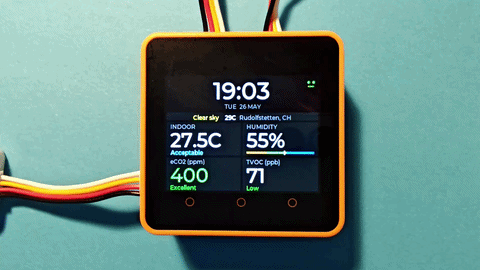
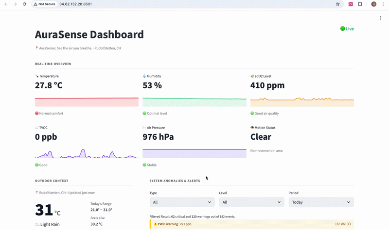
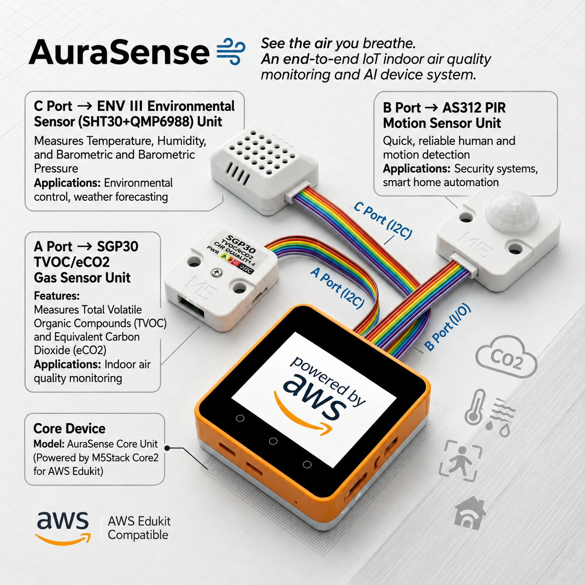

# AuraSense 🌬️
> *See the air you breathe. An end-to-end IoT indoor air quality monitoring and AI advice system.*

[](https://m5stack.com/)
[](https://micropython.org/)
[](https://www.python.org/)
[](https://www.docker.com/)
[](https://cloud.google.com/)
[](https://aistudio.google.com/)

---

### 🌟 Quick Links

[](https://www.youtube.com/watch?v=83zbSBvbl1c)
[](https://github.com/embarky/AuraSense-M5StackCore2)
[](http://34.62.132.20:8501/)

---

## 1. Project Overview

AuraSense is a comprehensive IoT solution designed to monitor, analyze, and visualize indoor air quality in real-time. Built with an edge-to-cloud architecture, it utilizes an M5Stack Core2 device to collect environmental data (eCO2, TVOC, Temperature, Humidity, Motion) and transmits it to a containerized Google Cloud Platform (GCP) backend.

Beyond simple data logging, AuraSense integrates contextual outdoor weather data and dynamic voice announcements to provide actionable, human-centric advice for a healthier living environment.

---



---



---

## 2. System Architecture & Tech Stack

AuraSense implements a decoupled architecture, separating edge telemetry acquisition from cloud-based analytics.

### 🔌 Edge Layer (M5Stack Core2)



* **Main Controller:** [M5Stack Core2 for AWS Edukit](https://docs.m5stack.com/en/core/core2_for_aws) (ESP32-D0WDQ6-V3, Touch Screen, integrated SPM1423 microphone, SK6812 RGB LED strip)
* **Firmware & Runtime:** UIFlow2.0 V2.4.4-CORE2 executing MicroPython
* **Hardware Port Mapping:**

  | Port | Sensor | Measures |
  |------|--------|----------|
  | Port A (I2C) | SGP30 TVOC/eCO2 Gas Sensor | eCO2, TVOC |
  | Port B (GPIO) | AS312 PIR Motion Sensor | Motion detection |
  | Port C (I2C) | ENV III Unit (SHT30 + QMP6988) | Temperature, Humidity, Pressure |

### ☁️ Cloud & Analytics Layer (GCP)

| Component | Technology | Role |
|-----------|-----------|------|
| Backend | Python / Flask | API server, AI orchestration |
| Data Lake | Google BigQuery | Time-series sensor persistence |
| Dashboard | Streamlit | Real-time analytics UI |
| AI Engine | Google Gemini API | Advice generation, voice assistant |
| TTS | Edge TTS | Speech synthesis |
| Weather | OpenWeatherMap API | Outdoor context |
| Infrastructure | Docker Compose on GCP | Containerized deployment |

---

## 3. Key Features

* 📡 **Edge Telemetry** — Real-time data ingestion every 3 seconds, upload every 30 seconds
* 🧠 **Context-Aware AI Advice** — Analyzes indoor/outdoor differentials to suggest physical actions
* 🎙️ **Voice Assistant** — Push-to-talk with Gemini-powered multi-turn conversation
* 🚨 **Smart Hardware Alerts** — RGB LED strip with threshold-based warning/danger states
* 🌦️ **Weather Fusion** — IP-based geolocation with 5-day OpenWeatherMap forecast
* 📊 **Live Dashboard** — Sparklines, anomaly log, trend analysis and AI recommendations
* 🔇 **Offline Mode** — Full sensor monitoring and LED alerts without WiFi

---

## 4. Feature Specifications

### LED Alert Strategy (IO25 / SK6812 RGB)

| State | Color | Interval | Condition |
|-------|-------|----------|-----------|
| Normal | OFF | — | All values within safe range |
| Warning | 🟡 Yellow | 500ms flash | eCO2 > 800 ppm OR TVOC > 220 ppb OR humidity < 30% / > 65% |
| Critical | 🔴 Red | 250ms flash | eCO2 > 1500 ppm OR TVOC > 660 ppb OR humidity < 20% / > 75% |

### Screen Policy

| State | Brightness | Trigger |
|-------|-----------|---------|
| Active | 100% | Motion detected / button / touch |
| Dimmed | 20% | 60 seconds of no motion |
| Off | 0% | 120 seconds of no motion |

### Upload Intervals

| Mode | Interval | Trigger |
|------|----------|---------|
| Standard | 30 seconds | Normal operation |
| Burst | 5 seconds | Warning/danger state active |
| Immediate | Instant | Critical anomaly initialized |

### Voice Alerts

* Triggered when Critical threshold persists for > **10 seconds**
* Repeats every **30 seconds** while danger persists
* Fires even when screen is off — overnight safety guaranteed

---

## 5. Deployment

### Required Services & API Keys

Before deploying, obtain the following:

| Service | Purpose | Where to get |
|---------|---------|--------------|
| Google Gemini API | AI advice + voice assistant | [aistudio.google.com](https://aistudio.google.com/) |
| OpenWeatherMap API | Outdoor weather context | [openweathermap.org](https://openweathermap.org/api) |
| GCP Service Account | BigQuery read/write access | GCP Console → IAM |
| Google BigQuery | Sensor data persistence | GCP Console |

### Device Setup

1. Flash **UIFlow2.0 V2.4.4-CORE2** via [M5Burner](https://m5stack.com/pages/download)
2. In Thonny REPL, run once to disable MQTT and boot directly into `main.py`:
   ```python
   import esp32
   nvs = esp32.NVS("uiflow")
   nvs.set_u8("boot_option", 0)
   nvs.set_blob("server", b"")
   nvs.commit()
   ```
3. Edit `device/config.py` with your WiFi credentials and server IP
4. Upload all files from `device/` to `/flash/` using Thonny

### Server Deployment

1. Place your GCP service account JSON key in `backend/` and `dashboard/`
2. Fill in `backend/config.json` with your API keys and GCP project details
3. Update the credential paths in `docker-compose.yml` to absolute paths on your server
4. Run:
   ```bash
   docker-compose up -d --build
   ```
5. Open port **5001** and **8501** in your firewall/security group

Dashboard will be available at `http://YOUR_SERVER_IP:8501`

> See `docker-compose.yml` and the `backend/` and `dashboard/` Dockerfiles for the full container configuration.

---

## 6. Data Persistence

* **Google BigQuery** — time-series warehouse for all sensor readings
* **Timezone:** All timestamps normalized to `Europe/Zurich`
* **Schema:** `timestamp`, `temperature`, `humidity`, `pressure`, `eco2`, `tvoc`, `motion_detected`, `timezone`
* **Query windows:** 1h / 24h / 7d / custom range supported

---

## Individual Contributions

| Member | Contributions |
|--------|--------------|
| **Hang Yang** | Device firmware (MicroPython) — sensor integration, LED alert system, screen management, voice assistant, WiFi stability and network resilience. Flask backend — API design, Gemini AI integration, TTS pipeline, BigQuery persistence, weather service, Docker deployment on GCP. |
| **Yi Huang** | Streamlit dashboard — real-time overview, sparkline charts, outdoor weather card, anomaly log panel, trend analysis, historical insights, AI advice integration, online/offline detection. |

---

## Made by

**Hang Yang & Yi Huang** — University of Lausanne, Cloud and Advanced Analytics 2026

---

*AuraSense — See the air you breathe.*